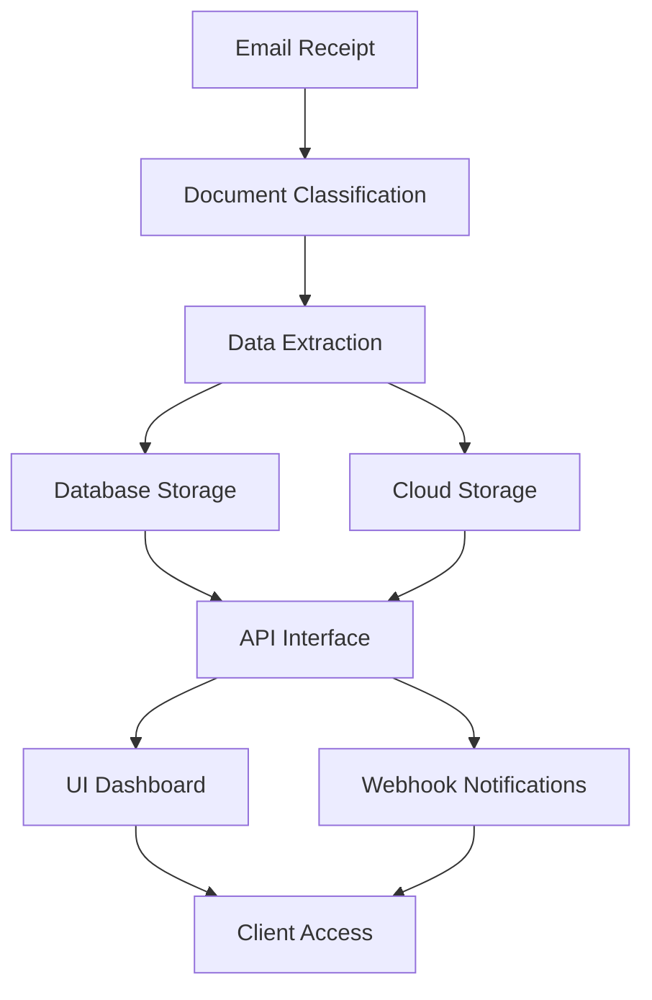
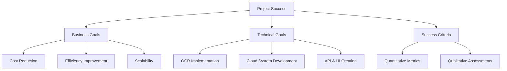
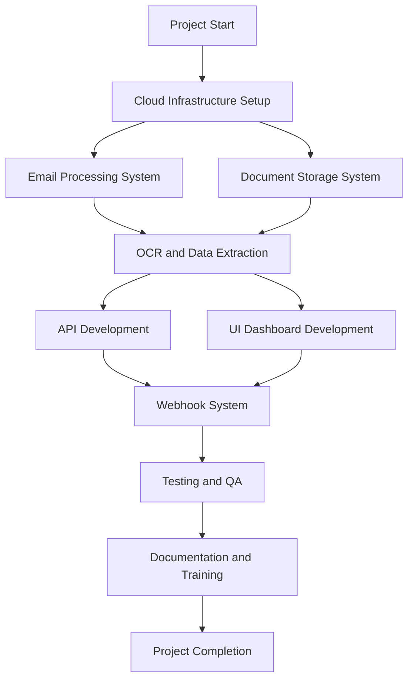
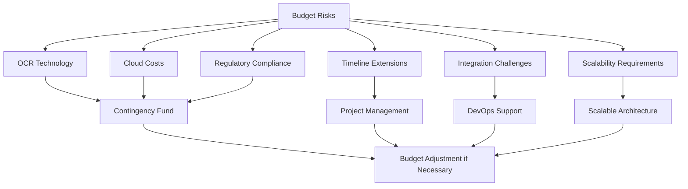
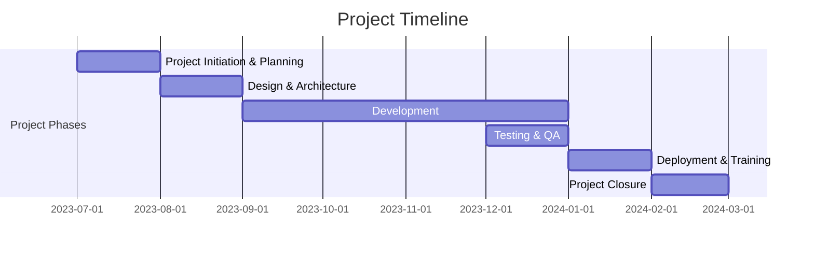
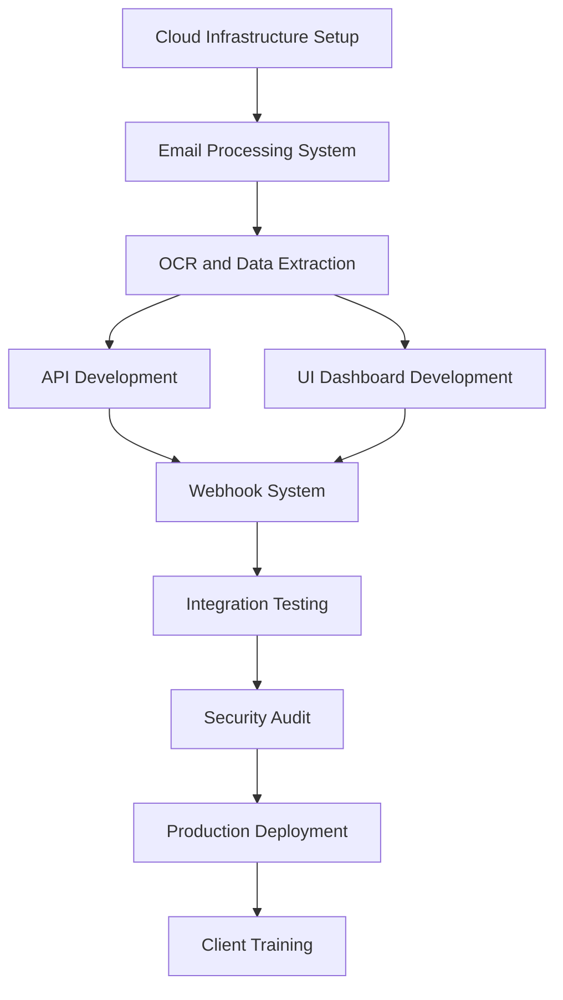
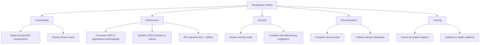

## EXECUTIVE SUMMARY

### PROJECT OVERVIEW

Dollar Funding, a Merchant Cash Advance (MCA) provider, seeks to revolutionize their application processing system by implementing a cloud-based solution. This project aims to automate the manual data entry process for MCA applications, which are currently received via email and processed by a team of 30 employees. The proposed solution will digitize and streamline the entire workflow, from email receipt to data extraction and client notification.

The system will:
1. Process incoming emails and attachments
2. Extract and classify relevant information from PDF documents
3. Store data securely in a database and cloud storage
4. Provide API and UI interfaces for client interaction
5. Implement webhook notifications for real-time updates

This automation will significantly reduce manual labor, increase efficiency, and improve accuracy in processing MCA applications.

### OBJECTIVES

1. Automate 93% of manual data entry work, replacing 28 out of 30 current staff members
2. Implement a state-of-the-art OCR solution capable of handling imperfect and handwritten applications
3. Develop a secure, scalable, and highly available cloud-based system
4. Create user-friendly API and UI interfaces for seamless client interaction
5. Establish a robust webhook system for real-time application status updates
6. Ensure compliance with data privacy and security regulations

### VALUE PROPOSITION

Our agency offers a unique combination of expertise and innovation to deliver a cutting-edge solution for Dollar Funding:

1. Specialized OCR Technology: Our advanced OCR solution is tailored to handle the complexities of MCA applications, including handwritten and imperfectly scanned documents.

2. End-to-End Automation: We provide a comprehensive solution that covers the entire workflow, from email processing to data extraction and client notification.

3. Scalability and Reliability: Our cloud-based architecture ensures the system can handle increasing workloads while maintaining high availability.

4. Customized Integration: We offer both API and UI interfaces, allowing seamless integration with Dollar Funding's existing systems and processes.

5. Cost-Effective Solution: By automating 93% of manual data entry, we significantly reduce operational costs and improve overall efficiency.

6. Ongoing Support and Maintenance: Our team provides continuous support to ensure the system remains up-to-date and performs optimally.

This value proposition positions our agency as the ideal partner to transform Dollar Funding's MCA application processing, driving efficiency and growth in their business operations.

## PROJECT OBJECTIVES

### BUSINESS GOALS

1. Automate 93% of manual data entry work, reducing operational costs by replacing 28 out of 30 current staff members
2. Increase processing speed and efficiency of MCA applications by at least 80%
3. Improve accuracy of data extraction and classification to 99.9%
4. Enhance scalability to handle a 200% increase in application volume without additional resources
5. Reduce application processing time from an average of 2 days to 2 hours
6. Improve client satisfaction by providing real-time updates and faster application processing

### TECHNICAL GOALS

1. Implement a state-of-the-art OCR solution capable of handling imperfect and handwritten applications with 99% accuracy
2. Develop a secure, scalable, and highly available cloud-based system with 99.99% uptime
3. Create a RESTful API for seamless integration with client systems and third-party applications
4. Design and implement a user-friendly UI dashboard for easy access to application information and system management
5. Establish a robust webhook system for real-time application status updates
6. Implement secure cloud storage for application documents with role-based access control
7. Develop a flexible database schema to accommodate future expansion of data fields and application types
8. Ensure compliance with data privacy and security regulations (e.g., GDPR, CCPA)

### SUCCESS CRITERIA

| Criterion | Target | Measurement Method |
|-----------|--------|---------------------|
| Manual data entry reduction | 93% | Comparison of staff headcount before and after implementation |
| Application processing speed | 80% improvement | Average time from email receipt to data extraction completion |
| OCR accuracy | 99% | Random sampling and manual verification of extracted data |
| System uptime | 99.99% | Monitoring logs and downtime reports |
| Application volume handling | 200% increase | Stress testing and performance monitoring |
| Client satisfaction | 90% approval rating | Post-implementation survey and feedback analysis |
| API response time | < 200ms | Performance testing and monitoring |
| UI dashboard user adoption | 95% of clients | Usage analytics and user feedback |
| Webhook delivery success rate | 99.9% | Webhook delivery logs and error tracking |
| Data privacy compliance | 100% adherence | Regular audits and compliance checks |

The project's success will be determined by meeting or exceeding these business and technical goals, as measured by the defined success criteria. Regular monitoring and reporting will be conducted throughout the project lifecycle to ensure alignment with these objectives.

## SCOPE OF WORK

### IN-SCOPE

1. Email Processing System
   - Develop an automated system to monitor and process emails received at submissions@dollarfunding.com
   - Extract and store email metadata (sender, body, subject, etc.) in a database
   - Track application status (Processing, Ready, Failed)

2. Document Classification and Storage
   - Implement an AI-powered document classification system for PDF attachments
   - Categorize documents as ISO applications, bank statements, or voided checks
   - Develop a secure cloud storage system for classified documents with role-based access control

3. OCR and Data Extraction
   - Implement a state-of-the-art OCR solution capable of processing imperfect and handwritten applications
   - Extract key information from ISO applications, including:
     - Merchant details (Business legal name, DBA name, Federal Tax ID/EIN, Address, Industry, Revenue)
     - Funding details (Funding requested, use of funds)
     - Owner information (Name, SSN, Address, Date of Birth, ownership percentage)
   - Store extracted data in a secure, scalable database

4. API Development
   - Create a RESTful API for client integration, including:
     - Application data retrieval
     - Document download
     - Webhook registration and management

5. UI Dashboard
   - Develop a user-friendly dashboard for:
     - Viewing application information and attachments
     - Managing webhooks (add, edit, remove)
     - Accessing system analytics and reports

6. Webhook Notification System
   - Implement a robust webhook system for real-time notifications on:
     - Application processing completion
     - Review requests for failed processing or missing critical information (SSN, Federal Tax ID)

7. Security and Compliance
   - Implement encryption for data at rest and in transit
   - Ensure compliance with relevant data privacy regulations (e.g., GDPR, CCPA)
   - Implement audit logging and access controls

8. Scalability and High Availability
   - Design and implement a cloud-based architecture for scalability and high availability
   - Set up load balancing and auto-scaling capabilities

9. Testing and Quality Assurance
   - Conduct thorough testing of all system components
   - Perform security audits and penetration testing

10. Documentation and Training
    - Provide comprehensive system documentation
    - Deliver training materials and sessions for Dollar Funding staff

### OUT-OF-SCOPE

1. Physical hardware procurement or on-premises infrastructure setup
2. Integration with Dollar Funding's internal systems beyond the provided API and webhook interfaces
3. Manual data entry or correction of extracted information
4. Development of mobile applications for the system
5. Processing of non-PDF document formats
6. Handling of emails received at addresses other than submissions@dollarfunding.com
7. Automatic decision-making or approval processes for MCA applications
8. Long-term data archiving or backup solutions beyond standard cloud storage practices
9. Customer support for Dollar Funding's clients or brokers

### ASSUMPTIONS

1. Dollar Funding will provide timely access to necessary information, including sample applications and current process documentation
2. The client will assign a dedicated point of contact for the duration of the project
3. All necessary third-party services and APIs will be available and accessible throughout the project lifecycle
4. Dollar Funding will handle any necessary communications with their clients and brokers regarding the new system
5. The client will provide access to a test environment that mimics their production setup for integration testing
6. The volume of applications will not exceed 200% of the current volume during the initial implementation phase
7. Dollar Funding will be responsible for any necessary changes to their email system to ensure proper routing to the new application processing system

### DEPENDENCIES

1. Cloud Infrastructure: The project depends on the successful setup and configuration of the chosen cloud platform (e.g., AWS, Azure, or Google Cloud)

2. Email System Integration: Proper functioning of the system depends on correct configuration of Dollar Funding's email system to forward applications to the processing system

3. OCR Technology: The project relies on the availability and performance of the chosen OCR technology or service

4. Third-party APIs: Any external APIs or services used for document processing, data validation, or other functions must be available and perform as expected

5. Regulatory Compliance: The project timeline may be affected by the need to ensure compliance with relevant data privacy and security regulations

6. Client Resources: Timely feedback, approvals, and resource allocation from Dollar Funding are crucial for meeting project milestones

7. Data Migration: If historical data needs to be migrated to the new system, this process may impact the project timeline

8. Integration Testing: Availability of a representative test environment from Dollar Funding is necessary for thorough integration testing

9. Security Audits: The project timeline may be affected by the scheduling and results of security audits and penetration testing

10. Training Schedule: The availability of Dollar Funding staff for training sessions may impact the final stages of the project

## BUDGET AND COST ESTIMATES

### COST BREAKDOWN

The following table provides a detailed breakdown of the project costs:

| Category | Item | Cost (USD) |
|----------|------|------------|
| Labor | Project Manager (800 hours @ $150/hr) | 120,000 |
| Labor | Senior Software Engineers (3000 hours @ $120/hr) | 360,000 |
| Labor | UI/UX Designer (400 hours @ $100/hr) | 40,000 |
| Labor | QA Specialist (600 hours @ $90/hr) | 54,000 |
| Labor | DevOps Engineer (400 hours @ $110/hr) | 44,000 |
| Software | OCR Technology License | 50,000 |
| Software | Cloud Services (AWS/Azure/GCP) for 1 year | 60,000 |
| Software | Development Tools and Licenses | 15,000 |
| Hardware | Development and Testing Equipment | 20,000 |
| Services | Security Audit and Penetration Testing | 30,000 |
| Services | Legal and Compliance Consultation | 25,000 |
| Contingency | 10% of total budget | 81,800 |
| **Total** | | **899,800** |

### PAYMENT SCHEDULE

The proposed payment schedule is tied to project milestones and deliverables:

| Milestone | Percentage | Amount (USD) | Due Date |
|-----------|------------|--------------|----------|
| Project Kickoff | 20% | 179,960 | Upon contract signing |
| Email Processing and Document Classification System | 15% | 134,970 | End of Month 2 |
| OCR and Data Extraction System | 20% | 179,960 | End of Month 4 |
| API and UI Dashboard Development | 15% | 134,970 | End of Month 6 |
| Webhook System and Integration | 10% | 89,980 | End of Month 7 |
| Testing and QA Completion | 10% | 89,980 | End of Month 8 |
| Final Deployment and Training | 10% | 89,980 | End of Month 9 |

### BUDGET CONSIDERATIONS

Several factors could impact the budget, and we have strategies in place to manage these risks:

1. OCR Technology Performance:
   - Risk: The chosen OCR solution may require additional customization or a more expensive alternative to meet accuracy requirements.
   - Mitigation: We have allocated a substantial budget for OCR licensing and included contingency funds. If needed, we can reallocate resources from other areas or propose a budget adjustment.

2. Cloud Service Costs:
   - Risk: Actual usage may exceed estimates, particularly as the system scales.
   - Mitigation: We will implement cloud cost monitoring and optimization strategies. The contingency budget can cover initial overages, and we'll work with Dollar Funding to adjust the budget if long-term changes are needed.

3. Regulatory Compliance:
   - Risk: Changes in data privacy regulations or additional compliance requirements may increase costs.
   - Mitigation: We have budgeted for legal consultation and included compliance considerations in our development process. The contingency fund can cover minor additional costs.

4. Project Timeline Extensions:
   - Risk: Delays could increase labor costs.
   - Mitigation: Our project management approach includes buffer time in critical path activities. We will closely monitor progress and communicate any potential delays early to minimize impact.

5. Integration Challenges:
   - Risk: Unforeseen difficulties in integrating with Dollar Funding's existing systems could require additional development time.
   - Mitigation: We have allocated time for integration testing and included a DevOps engineer in the team. If major issues arise, we may need to reassess the project scope or timeline.

6. Scalability Requirements:
   - Risk: If the system needs to scale beyond the initial 200% increase in volume, additional infrastructure costs may be incurred.
   - Mitigation: Our architecture is designed for scalability. We will monitor system performance and work with Dollar Funding to adjust the budget if significant scaling is required beyond the initial scope.

We will actively monitor these budget considerations throughout the project lifecycle and communicate transparently with Dollar Funding about any potential impacts. Our goal is to deliver the project within the proposed budget while maintaining the flexibility to address unforeseen challenges.

## TIMELINE AND MILESTONES

### PROJECT TIMELINE

The project is estimated to take 9 months from initiation to completion. Here's a high-level timeline outlining the major phases:

### KEY MILESTONES

| Milestone | Description | Target Date |
|-----------|-------------|-------------|
| M1: Project Kickoff | Project charter approved, team assembled | 2023-07-15 |
| M2: Design Approval | System architecture and design documents finalized | 2023-08-31 |
| M3: Email Processing System | Email processing and document classification completed | 2023-09-30 |
| M4: OCR and Data Extraction | OCR implementation and data extraction system completed | 2023-10-31 |
| M5: API Development | RESTful API for client integration completed | 2023-11-30 |
| M6: UI Dashboard | User interface for application management completed | 2023-12-15 |
| M7: Webhook System | Real-time notification system implemented | 2023-12-31 |
| M8: Testing Complete | All system components tested and approved | 2024-01-15 |
| M9: Deployment | System deployed to production environment | 2024-01-31 |
| M10: Training Complete | Client staff trained on system usage | 2024-02-15 |
| M11: Project Closure | Final documentation delivered, project signed off | 2024-02-29 |

### CRITICAL PATH

The following tasks and activities are critical to keeping the project on schedule:

1. Cloud Infrastructure Setup (2 weeks)
2. Email Processing System Development (4 weeks)
3. OCR Technology Integration and Data Extraction System (6 weeks)
4. API Development (4 weeks)
5. UI Dashboard Development (4 weeks)
6. Webhook System Implementation (3 weeks)
7. Integration Testing (2 weeks)
8. Security Audit and Penetration Testing (2 weeks)
9. Production Deployment (1 week)
10. Client Training (2 weeks)

Any delays in these critical path activities could potentially impact the overall project timeline. Close monitoring and proactive management of these tasks will be essential to ensure timely project completion.

## DELIVERABLES

### LIST OF DELIVERABLES

1. Cloud-Based Application Processing System
   - Email Processing Module
   - Document Classification System
   - OCR and Data Extraction Engine
   - Secure Cloud Storage Solution
   - Database Management System
   - RESTful API
   - User Interface Dashboard
   - Webhook Notification System

2. Documentation
   - System Architecture Document
   - API Documentation
   - User Manual for UI Dashboard
   - Administrator Guide
   - Security and Compliance Report

3. Training Materials
   - User Training Guide
   - Video Tutorials
   - API Integration Guide for Developers

4. Source Code and Repositories
   - Fully commented source code
   - Version control repository access

5. Testing and Quality Assurance
   - Test Plans and Test Cases
   - QA Reports
   - Performance Test Results

6. Deployment Package
   - Deployment Guide
   - Configuration Files
   - Environment Setup Scripts

### DELIVERY SCHEDULE

| Deliverable | Expected Delivery Date |
|-------------|------------------------|
| System Architecture Document | End of Month 1 |
| Email Processing Module | End of Month 2 |
| Document Classification System | End of Month 2 |
| OCR and Data Extraction Engine | End of Month 4 |
| Secure Cloud Storage Solution | End of Month 4 |
| Database Management System | End of Month 5 |
| RESTful API | End of Month 6 |
| API Documentation | End of Month 6 |
| User Interface Dashboard | End of Month 7 |
| Webhook Notification System | End of Month 7 |
| User Manual for UI Dashboard | End of Month 7 |
| Administrator Guide | End of Month 8 |
| Security and Compliance Report | End of Month 8 |
| Test Plans and Test Cases | End of Month 8 |
| QA Reports | End of Month 8 |
| Performance Test Results | End of Month 8 |
| User Training Guide | End of Month 9 |
| Video Tutorials | End of Month 9 |
| API Integration Guide for Developers | End of Month 9 |
| Deployment Guide | End of Month 9 |
| Configuration Files | End of Month 9 |
| Environment Setup Scripts | End of Month 9 |
| Source Code and Repository Access | End of Month 9 |

### ACCEPTANCE CRITERIA

1. Functionality
   - The system successfully processes emails from submissions@dollarfunding.com
   - Document classification accurately identifies ISO applications, bank statements, and voided checks
   - OCR engine extracts data with 99% accuracy, including from imperfect and handwritten applications
   - API and UI provide all specified features and data access
   - Webhook system delivers notifications reliably and in real-time

2. Performance
   - System automates 93% of manual data entry work
   - Handles a 200% increase in application volume without performance degradation
   - API response time is less than 200ms for 95% of requests
   - System maintains 99.99% uptime during a 30-day monitoring period

3. Security
   - Passes third-party security audit and penetration testing
   - Implements encryption for data at rest and in transit
   - Complies with relevant data privacy regulations (e.g., GDPR, CCPA)
   - Implements role-based access control for all system components

4. Documentation
   - All documentation is complete, accurate, and follows industry standards
   - API documentation includes all endpoints, request/response formats, and example usage
   - User manual covers all UI dashboard features and is easy to understand

5. Training Materials
   - Training guides and video tutorials cover all aspects of system usage
   - API integration guide provides clear instructions for developers

6. Source Code and Deployment
   - Source code is well-commented and follows agreed-upon coding standards
   - Deployment package successfully sets up the system in a clean environment
   - Configuration files and setup scripts are provided and functional

7. Testing and QA
   - All test cases pass successfully
   - Performance tests demonstrate the system meets or exceeds specified metrics
   - QA reports show no critical or high-priority issues remaining

Each deliverable will be reviewed against these criteria, and formal acceptance will require sign-off from designated Dollar Funding stakeholders. Any deviations or issues will be addressed before final acceptance is granted.