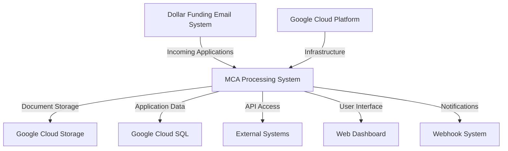
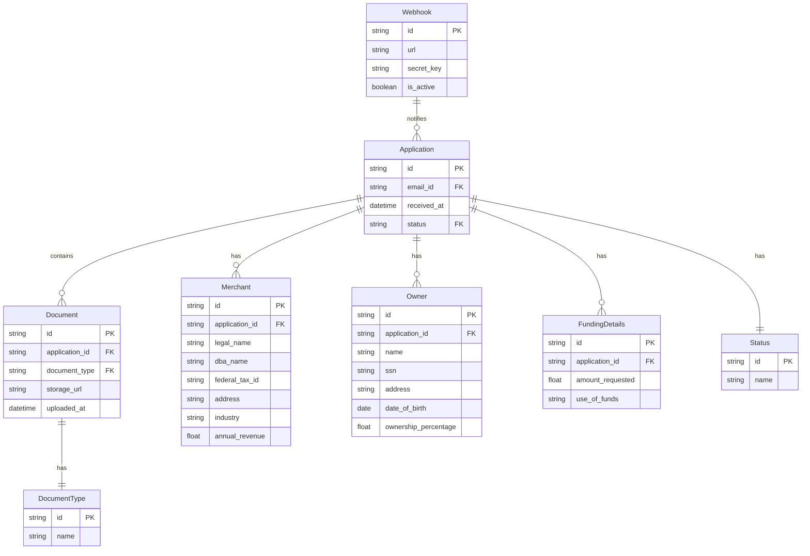
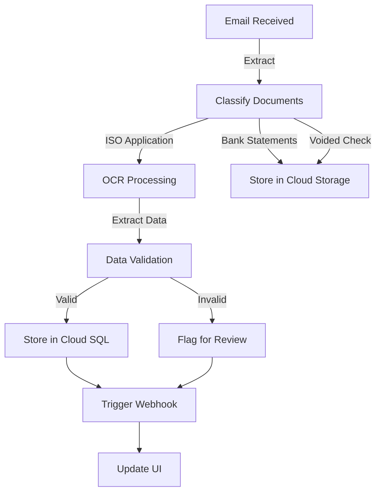

# INTRODUCTION

## PURPOSE

This Software Requirements Specification (SRS) document serves as a comprehensive guide for the development of the cloud-based Merchant Cash Advance (MCA) application processing system for Dollar Funding. The primary purpose of this document is to:

1. Clearly define the functional and non-functional requirements of the system
2. Establish a shared understanding between Dollar Funding and the development team
3. Provide a reference for technical and managerial personnel throughout the project lifecycle
4. Serve as a basis for estimating costs, schedules, and resource allocation
5. Act as a benchmark for validation and verification processes

The intended audience for this SRS includes:

- Dollar Funding stakeholders and decision-makers
- Project managers and team leads
- Software developers and engineers
- Quality assurance and testing teams
- System administrators and DevOps personnel
- Future maintenance and support staff

This document assumes that readers have a basic understanding of MCA processes and general software development concepts.

## SCOPE

The MCA application processing system is a cloud-based solution designed to automate and streamline Dollar Funding's current manual process for handling Merchant Cash Advance applications. This system aims to revolutionize the way Dollar Funding processes applications, significantly reducing manual labor and increasing efficiency.

### Goals

1. Automate 93% of manual data entry work
2. Increase processing speed and accuracy of MCA applications
3. Provide a scalable solution to handle growing application volumes
4. Ensure secure and compliant handling of sensitive financial information
5. Offer real-time status updates and easy access to application data

### Benefits

1. Reduced operational costs by replacing 28 out of 30 current staff members
2. Improved accuracy and consistency in data extraction and processing
3. Faster application processing times, leading to improved client satisfaction
4. Enhanced scalability to accommodate business growth
5. Improved data security and regulatory compliance

### Core Functionalities

1. Email Processing System
   - Automatically monitor and process emails received at submissions@dollarfunding.com
   - Extract and store email metadata
   - Track application status (Processing, Ready, Failed)

2. Document Classification and Storage
   - AI-powered classification of PDF attachments (ISO applications, bank statements, voided checks)
   - Secure cloud storage for classified documents

3. OCR and Data Extraction
   - State-of-the-art OCR solution capable of processing imperfect and handwritten applications
   - Extraction of key information from ISO applications, including merchant details, funding details, and owner information

4. API Development
   - RESTful API for client integration, built with Python
   - Endpoints for application data retrieval, document download, and webhook management

5. UI Dashboard
   - User-friendly interface developed with React and Tailwind CSS
   - Features for viewing application information, managing webhooks, and accessing system analytics

6. Webhook Notification System
   - Real-time notifications for application processing status and review requests

7. Security and Compliance
   - Implementation of data encryption, access controls, and audit logging
   - Ensuring compliance with relevant data privacy regulations

8. Scalability and High Availability
   - Cloud-based architecture using Google Cloud Platform for scalability and high availability

The system will be developed using Python for the backend services, leveraging the Google Cloud ecosystem for infrastructure and cloud services. The user interface will be built using React and Tailwind CSS, ensuring a modern, responsive, and user-friendly experience.

This comprehensive solution will transform Dollar Funding's MCA application processing, positioning the company for increased efficiency, accuracy, and growth in the competitive financial services market.

# PRODUCT DESCRIPTION

## PRODUCT PERSPECTIVE

The Merchant Cash Advance (MCA) application processing system is a cloud-based solution designed to integrate seamlessly into Dollar Funding's existing business operations. It serves as a central hub for automating the processing of MCA applications, replacing the current manual system. The product fits into the larger ecosystem as follows:

1. Email Integration: The system interfaces with Dollar Funding's email infrastructure to monitor and process incoming applications at submissions@dollarfunding.com.

2. Cloud Infrastructure: Leveraging the Google Cloud Platform (GCP), the system utilizes various GCP services for scalability, reliability, and security.

3. Data Storage: The system interacts with both structured (Cloud SQL for application data) and unstructured (Cloud Storage for document storage) data storage solutions within GCP.

4. External Integrations: The system provides RESTful APIs for potential future integrations with Dollar Funding's other internal systems or third-party services.

5. User Interface: A web-based dashboard built with React and Tailwind CSS allows Dollar Funding staff to interact with the system, view applications, and manage workflows.

6. Notification System: The webhook functionality integrates with Dollar Funding's existing notification infrastructure to provide real-time updates on application status.



## PRODUCT FUNCTIONS

The MCA application processing system provides the following key functions:

1. Email Processing:
   - Automatically monitor the submissions@dollarfunding.com inbox
   - Extract email metadata (sender, subject, body, attachments)
   - Initiate the application processing workflow

2. Document Classification:
   - Analyze and categorize PDF attachments (ISO applications, bank statements, voided checks)
   - Store classified documents in Google Cloud Storage with appropriate metadata

3. OCR and Data Extraction:
   - Perform Optical Character Recognition on application documents
   - Extract key information from ISO applications, including merchant details, funding details, and owner information
   - Handle imperfect and handwritten applications with high accuracy

4. Data Management:
   - Store extracted application data in Google Cloud SQL
   - Maintain data integrity and relationships between applications and documents

5. API Services:
   - Provide RESTful API endpoints for:
     - Retrieving application data
     - Downloading documents
     - Managing webhooks
   - Implement authentication and authorization for API access

6. User Interface:
   - Present a web-based dashboard for Dollar Funding staff
   - Display application information and status
   - Allow document viewing and download
   - Provide webhook management interface
   - Offer system analytics and reporting

7. Notification System:
   - Implement webhook functionality for real-time status updates
   - Notify clients of application processing completion or review requirements

8. Security and Compliance:
   - Encrypt data at rest and in transit
   - Implement role-based access control
   - Ensure compliance with data privacy regulations
   - Provide audit logging for system activities

9. Scalability and Performance:
   - Utilize Google Cloud Platform's auto-scaling capabilities
   - Optimize system performance to handle increased application volumes

## USER CHARACTERISTICS

The MCA application processing system is designed for the following user groups:

1. Data Entry Specialists (Remaining 2 out of 30):
   - Expertise: Moderate to high in MCA application processing
   - Responsibilities: Handling complex cases, performing quality checks, and managing exceptions
   - Needs: Efficient interface for reviewing and managing applications, access to detailed application data

2. Management Team:
   - Expertise: High in business operations, moderate in technical systems
   - Responsibilities: Overseeing the application process, making strategic decisions
   - Needs: Access to analytics dashboard, performance reports, and system status updates

3. IT Support Staff:
   - Expertise: High in technical systems and integrations
   - Responsibilities: Maintaining system health, managing integrations, and troubleshooting issues
   - Needs: Access to system logs, configuration settings, and API documentation

4. Compliance Officers:
   - Expertise: High in regulatory requirements and data privacy laws
   - Responsibilities: Ensuring system compliance with relevant regulations
   - Needs: Access to audit logs, data handling reports, and security settings

User Personas:

1. Sarah, Data Entry Specialist:
   - 35 years old, 10 years of experience in MCA processing
   - Highly detail-oriented, comfortable with technology
   - Needs: Efficient interface for reviewing complex applications and managing exceptions

2. Michael, Operations Manager:
   - 45 years old, 15 years in financial services management
   - Strategic thinker, focused on efficiency and growth
   - Needs: Real-time analytics dashboard, performance reports, and system status updates

3. Alex, IT Support Specialist:
   - 28 years old, 5 years in fintech support roles
   - Technically savvy, experienced with cloud systems
   - Needs: Comprehensive system documentation, access to logs, and API management tools

4. Lisa, Compliance Officer:
   - 40 years old, 12 years in financial compliance
   - Detail-oriented, strong knowledge of regulatory requirements
   - Needs: Audit trails, data privacy controls, and compliance reporting features

## CONSTRAINTS

1. Regulatory Compliance:
   - Must adhere to financial data protection regulations (e.g., GDPR, CCPA)
   - Compliance with industry-specific regulations for MCA providers

2. Technical Constraints:
   - Integration limited to email-based application submissions
   - Must work within the existing Google Cloud Platform ecosystem
   - OCR accuracy must meet or exceed 99% for handwritten and imperfect applications

3. Performance Constraints:
   - System must handle a 200% increase in application volume without degradation
   - API response times must be under 200ms for 95% of requests
   - 99.99% system uptime required

4. Security Constraints:
   - All data must be encrypted at rest and in transit
   - Strict access controls and audit logging required
   - Must pass third-party security audits and penetration testing

5. User Interface Constraints:
   - Must be web-based, compatible with modern browsers
   - Responsive design required for desktop and tablet devices
   - Accessibility compliance (WCAG 2.1 Level AA) required

6. Budgetary Constraints:
   - Development and first-year operational costs must not exceed $899,800
   - Ongoing operational costs must demonstrate significant savings over current manual process

7. Timeline Constraints:
   - System must be fully operational within 9 months from project initiation
   - Phased rollout may be necessary to meet critical deadlines

8. Scalability Constraints:
   - System must be designed to scale horizontally within GCP infrastructure
   - Database design must accommodate future expansion of data fields and application types

## ASSUMPTIONS AND DEPENDENCIES

Assumptions:

1. Dollar Funding will provide timely access to necessary information, including sample applications and current process documentation.
2. The volume of applications will not exceed 200% of the current volume during the initial implementation phase.
3. Dollar Funding's email system can be configured to properly route applications to the new processing system.
4. Users have access to modern web browsers and stable internet connections.
5. The current manual process can be accurately modeled and automated without unforeseen complexities.
6. Dollar Funding will handle any necessary communications with their clients and brokers regarding the new system.
7. The majority of applications will be in English, with consistent formatting across brokers.

Dependencies:

1. Google Cloud Platform Services:
   - Availability and performance of GCP services, including Cloud Storage, Cloud SQL, and Compute Engine
   - Continued support for chosen GCP APIs and services throughout the project lifecycle

2. OCR Technology:
   - Reliability and accuracy of the chosen OCR solution
   - Vendor support and timely updates for the OCR technology

3. Third-party Libraries and Frameworks:
   - Stability and security of React, Tailwind CSS, and other chosen libraries
   - Compatibility of these frameworks with the latest browser versions

4. Email System Integration:
   - Proper configuration and reliability of Dollar Funding's email infrastructure
   - Consistent email format and attachment types from brokers

5. Regulatory Environment:
   - Stability of current financial regulations affecting MCA providers
   - Timely updates on any regulatory changes that may impact the system

6. Data Migration:
   - Availability and integrity of historical data if migration is required
   - Cooperation from the current manual processing team during transition

7. Security and Compliance Audits:
   - Availability of third-party auditors for security assessments
   - Timely completion of security audits and penetration testing

8. Client Resources:
   - Availability of Dollar Funding staff for requirements gathering, testing, and training
   - Timely decision-making and approvals from Dollar Funding stakeholders

9. External APIs:
   - If integrating with any external services for data validation or enrichment, their availability and performance

10. Development Tools and Environment:
    - Availability and compatibility of development tools with the chosen technology stack
    - Stable development and testing environments that accurately represent the production setup

Here's the PROCESS FLOWCHART section for the Software Requirements Specification (SRS) using Mermaid JS:

## PROCESS FLOWCHART

The following flowchart illustrates the high-level process flow of the Merchant Cash Advance (MCA) application processing system:

```mermaid
graph TD
    A[Email Received] -->|submissions@dollarfunding.com| B{Email Processing}
    B -->|Extract Metadata| C[Store Email Data]
    B -->|Extract Attachments| D{Document Classification}
    D -->|ISO Application| E[OCR Processing]
    D -->|Bank Statements| F[Store in Cloud]
    D -->|Voided Check| F
    E -->|Extract Data| G[Data Extraction]
    G -->|Merchant Details| H[Store in Database]
    G -->|Funding Details| H
    G -->|Owner Information| H
    H --> I{Validation Check}
    I -->|Valid| J[Update Status: Ready]
    I -->|Invalid| K[Update Status: Failed]
    J --> L[Webhook Notification]
    K --> L
    L --> M{Client Action Required?}
    M -->|Yes| N[Notify for Review]
    M -->|No| O[End Process]
    F --> P[Update Document Status]
    P --> Q[API Available]
    H --> Q
    Q --> R[UI Dashboard Update]

    style A fill:#f9f,stroke:#333,stroke-width:2px
    style O fill:#bbf,stroke:#333,stroke-width:2px
    style Q fill:#bfb,stroke:#333,stroke-width:2px
    style R fill:#bfb,stroke:#333,stroke-width:2px
```

This flowchart represents the main processes of the MCA application processing system:

1. Email Reception: The system receives emails at submissions@dollarfunding.com.

2. Email Processing: The system extracts metadata and attachments from the email.

3. Document Classification: Attachments are classified as ISO applications, bank statements, or voided checks.

4. OCR Processing: ISO applications undergo OCR to extract text information.

5. Data Extraction: The system extracts merchant details, funding details, and owner information from the OCR results.

6. Data Storage: Extracted data is stored in the database, while documents are stored in secure cloud storage.

7. Validation: The system checks for the presence of critical information (e.g., SSN, Federal Tax ID).

8. Status Update: The application status is updated based on the validation results.

9. Webhook Notification: The system sends notifications about the application status via webhooks.

10. Client Action: If review is required, the client is notified.

11. API and UI Updates: The processed information is made available through the API and reflected in the UI dashboard.

This flowchart provides a visual representation of the system's core functionality, from email reception to final processing and notification. The backend processes are implemented in Python, while the UI dashboard is developed using React and Tailwind CSS, maintaining consistency with the technology choices made earlier in the document.

Here's a breakdown of the product features with the requested sub-sections:

1. Email Processing System

ID: F001
DESCRIPTION: Automatically process incoming emails at submissions@dollarfunding.com, extracting metadata and attachments.
PRIORITY: High

| Requirement ID | Requirement Description |
|----------------|--------------------------|
| F001-1 | Monitor submissions@dollarfunding.com inbox in real-time |
| F001-2 | Extract email metadata (sender, subject, body) |
| F001-3 | Extract and temporarily store PDF attachments |
| F001-4 | Update application status (Processing, Ready, Failed) |
| F001-5 | Trigger document classification process |

2. Document Classification System

ID: F002
DESCRIPTION: Classify incoming PDF documents as ISO applications, bank statements, or voided checks using AI-powered algorithms.
PRIORITY: High

| Requirement ID | Requirement Description |
|----------------|--------------------------|
| F002-1 | Implement AI model for document classification |
| F002-2 | Classify PDFs with 99% accuracy |
| F002-3 | Handle multiple document types in a single email |
| F002-4 | Store classified documents in Google Cloud Storage |
| F002-5 | Update document metadata with classification results |

3. OCR and Data Extraction Engine

ID: F003
DESCRIPTION: Extract text and relevant information from ISO applications using state-of-the-art OCR technology.
PRIORITY: Critical

| Requirement ID | Requirement Description |
|----------------|--------------------------|
| F003-1 | Implement OCR solution capable of processing imperfect and handwritten applications |
| F003-2 | Extract merchant details (Business name, DBA, Tax ID, Address, Industry, Revenue) |
| F003-3 | Extract funding details (Amount requested, use of funds) |
| F003-4 | Extract owner information (Name, SSN, Address, DOB, ownership percentage) |
| F003-5 | Achieve 99% accuracy in data extraction |

4. Database Management System

ID: F004
DESCRIPTION: Store and manage extracted application data in a secure, scalable database.
PRIORITY: High

| Requirement ID | Requirement Description |
|----------------|--------------------------|
| F004-1 | Implement Google Cloud SQL for structured data storage |
| F004-2 | Design schema to accommodate all extracted data fields |
| F004-3 | Implement data validation and integrity checks |
| F004-4 | Set up automatic backups and disaster recovery |
| F004-5 | Implement encryption for data at rest |

5. RESTful API

ID: F005
DESCRIPTION: Develop a secure API for client integration and data access.
PRIORITY: High

| Requirement ID | Requirement Description |
|----------------|--------------------------|
| F005-1 | Implement RESTful API using Python and Flask |
| F005-2 | Create endpoints for application data retrieval |
| F005-3 | Create endpoints for document download |
| F005-4 | Implement authentication and authorization |
| F005-5 | Provide API versioning for future updates |

6. User Interface Dashboard

ID: F006
DESCRIPTION: Develop a web-based dashboard for viewing and managing applications.
PRIORITY: Medium

| Requirement ID | Requirement Description |
|----------------|--------------------------|
| F006-1 | Create responsive UI using React and Tailwind CSS |
| F006-2 | Implement application listing and search functionality |
| F006-3 | Display detailed application information and attachments |
| F006-4 | Provide document viewer for PDF attachments |
| F006-5 | Implement user authentication and role-based access control |

7. Webhook Notification System

ID: F007
DESCRIPTION: Implement a system for sending real-time notifications about application status.
PRIORITY: Medium

| Requirement ID | Requirement Description |
|----------------|--------------------------|
| F007-1 | Develop webhook registration and management interface |
| F007-2 | Implement notification triggers for application status changes |
| F007-3 | Send notifications for completed processing and review requests |
| F007-4 | Implement retry mechanism for failed webhook deliveries |
| F007-5 | Provide webhook logs and delivery status information |

8. Security and Compliance Module

ID: F008
DESCRIPTION: Ensure system-wide security and compliance with relevant regulations.
PRIORITY: Critical

| Requirement ID | Requirement Description |
|----------------|--------------------------|
| F008-1 | Implement encryption for data in transit using HTTPS |
| F008-2 | Set up Google Cloud Identity and Access Management (IAM) |
| F008-3 | Implement audit logging for all system activities |
| F008-4 | Ensure compliance with GDPR and CCPA regulations |
| F008-5 | Conduct regular security audits and penetration testing |

9. Scalability and Performance Management

ID: F009
DESCRIPTION: Ensure the system can handle increased load and maintain high performance.
PRIORITY: High

| Requirement ID | Requirement Description |
|----------------|--------------------------|
| F009-1 | Implement auto-scaling for application servers using Google Kubernetes Engine |
| F009-2 | Set up load balancing for incoming traffic |
| F009-3 | Implement caching mechanisms for frequently accessed data |
| F009-4 | Optimize database queries for performance |
| F009-5 | Set up monitoring and alerting using Google Cloud Monitoring |

10. Reporting and Analytics Module

ID: F010
DESCRIPTION: Provide insights and reports on system performance and application processing.
PRIORITY: Low

| Requirement ID | Requirement Description |
|----------------|--------------------------|
| F010-1 | Develop dashboard for key performance indicators |
| F010-2 | Implement custom report generation functionality |
| F010-3 | Provide visualizations for application processing trends |
| F010-4 | Set up automated report scheduling and delivery |
| F010-5 | Integrate with Google Data Studio for advanced analytics |

## NON-FUNCTIONAL REQUIREMENTS

### PERFORMANCE

1. Response Time
   - API response time shall be less than 200ms for 95% of requests under normal load
   - UI dashboard shall load within 2 seconds on initial page load
   - Email processing shall be initiated within 30 seconds of receipt
   - OCR and data extraction shall complete within 60 seconds for a standard application

2. Throughput
   - The system shall be capable of processing at least 1000 applications per hour
   - The API shall handle a minimum of 100 concurrent requests
   - The database shall support at least 500 write operations per second

3. Resource Usage
   - The system shall utilize no more than 80% of allocated CPU resources during peak loads
   - Memory usage shall not exceed 16GB per application server instance
   - Database storage shall be optimized to use no more than 500GB for the first year of operation

### SAFETY

1. Data Backup
   - The system shall perform automated daily backups of all application data
   - Backups shall be stored in a geographically separate location from the primary data center
   - The system shall support point-in-time recovery for the past 30 days

2. Fault Tolerance
   - The system shall continue to function with degraded performance in case of single component failure
   - Critical system components shall have redundancy to ensure continuous operation

3. Error Handling
   - The system shall log all errors and exceptions with appropriate severity levels
   - Critical errors shall trigger automated alerts to the support team
   - The UI shall display user-friendly error messages without exposing system details

### SECURITY

1. Authentication
   - The system shall use OAuth 2.0 for API authentication
   - User authentication for the UI dashboard shall use multi-factor authentication
   - Passwords shall be hashed using bcrypt with a minimum work factor of 10

2. Authorization
   - The system shall implement role-based access control (RBAC) for all functions
   - API access shall be restricted using API keys and IP whitelisting
   - All access attempts shall be logged for audit purposes

3. Data Encryption
   - All data in transit shall be encrypted using TLS 1.3 or higher
   - Sensitive data at rest shall be encrypted using AES-256 encryption
   - Encryption keys shall be managed using Google Cloud Key Management Service

4. Privacy
   - The system shall comply with GDPR and CCPA requirements for data privacy
   - Personal Identifiable Information (PII) shall be pseudonymized where possible
   - Data retention policies shall be implemented to automatically delete unnecessary data

### QUALITY

1. Availability
   - The system shall maintain 99.99% uptime, allowing for no more than 52.56 minutes of downtime per year
   - Planned maintenance shall be scheduled during off-peak hours and communicated at least 48 hours in advance

2. Maintainability
   - The system shall use containerization (Docker) and orchestration (Kubernetes) for easy deployment and updates
   - All components shall have comprehensive unit tests with a minimum of 80% code coverage
   - The system shall use continuous integration and continuous deployment (CI/CD) pipelines

3. Usability
   - The UI shall be responsive and compatible with the latest versions of Chrome, Firefox, Safari, and Edge browsers
   - The system shall support keyboard navigation and screen readers for accessibility (WCAG 2.1 Level AA compliance)
   - The UI shall be designed using Tailwind CSS to ensure consistent styling and responsiveness

4. Scalability
   - The system shall be able to scale horizontally to handle a 300% increase in load
   - Database sharding shall be implemented to support future growth
   - The system shall use Google Cloud's auto-scaling features for compute resources

5. Reliability
   - The system shall have a Mean Time Between Failures (MTBF) of at least 720 hours
   - The Mean Time To Recover (MTTR) shall be less than 15 minutes for non-critical failures
   - All critical system functions shall have automated health checks running every 5 minutes

### COMPLIANCE

1. Legal Compliance
   - The system shall comply with all applicable laws and regulations in the jurisdictions where it operates
   - The system shall maintain an audit trail of all financial transactions for a minimum of 7 years

2. Regulatory Compliance
   - The system shall comply with PCI DSS requirements for handling financial data
   - The system shall adhere to SOC 2 Type II standards for security, availability, and confidentiality

3. Standards Compliance
   - The API shall follow RESTful design principles and use OpenAPI 3.0 specification
   - The system shall use ISO 8601 for date and time representations
   - All Python code shall adhere to PEP 8 style guide
   - React components shall follow the Airbnb React/JSX Style Guide

4. Accessibility Compliance
   - The UI shall comply with WCAG 2.1 Level AA standards
   - The system shall provide alternative text for all non-text content

5. Data Retention and Deletion
   - The system shall comply with data retention laws, keeping application data for a minimum of 5 years
   - The system shall provide mechanisms for data subjects to request data deletion in compliance with GDPR and CCPA

```mermaid
graph TD
    A[Non-Functional Requirements] --> B[Performance]
    A --> C[Safety]
    A --> D[Security]
    A --> E[Quality]
    A --> F[Compliance]
    B --> B1[Response Time]
    B --> B2[Throughput]
    B --> B3[Resource Usage]
    C --> C1[Data Backup]
    C --> C2[Fault Tolerance]
    C --> C3[Error Handling]
    D --> D1[Authentication]
    D --> D2[Authorization]
    D --> D3[Data Encryption]
    D --> D4[Privacy]
    E --> E1[Availability]
    E --> E2[Maintainability]
    E --> E3[Usability]
    E --> E4[Scalability]
    E --> E5[Reliability]
    F --> F1[Legal Compliance]
    F --> F2[Regulatory Compliance]
    F --> F3[Standards Compliance]
    F --> F4[Accessibility Compliance]
    F --> F5[Data Retention and Deletion]
```



These non-functional requirements ensure that the MCA application processing system for Dollar Funding is not only functionally complete but also performs well, remains secure, maintains high quality, and complies with necessary regulations and standards. The requirements are aligned with the previously chosen technologies and cloud ecosystem, emphasizing the use of Python for backend services, React and Tailwind CSS for the UI, and Google Cloud Platform for infrastructure and services.

## DATA REQUIREMENTS

### DATA MODELS

The MCA application processing system will use the following data models:



These data models will be implemented using Google Cloud SQL (PostgreSQL) for structured data storage. The models are designed to capture all necessary information from the MCA applications while maintaining flexibility for future expansions.

### DATA STORAGE

1. Structured Data Storage:
   - Google Cloud SQL (PostgreSQL) will be used for storing application data, merchant information, and system metadata.
   - Data retention: Application data will be retained for a minimum of 7 years to comply with financial regulations.
   - Redundancy: Cloud SQL will be configured with regional availability for high redundancy.
   - Backup: Automated daily backups will be performed with point-in-time recovery enabled for the past 30 days.
   - Recovery: A disaster recovery plan will be implemented with a Recovery Time Objective (RTO) of 1 hour and a Recovery Point Objective (RPO) of 5 minutes.

2. Unstructured Data Storage:
   - Google Cloud Storage will be used for storing PDF documents (ISO applications, bank statements, voided checks).
   - Data retention: Documents will be stored for the same duration as the application data (7 years minimum).
   - Redundancy: Multi-regional storage will be used to ensure high availability and durability.
   - Backup: Versioning will be enabled on Cloud Storage buckets to allow for easy recovery of overwritten or deleted objects.
   - Recovery: A separate backup bucket will be maintained with daily synchronization of all documents.

3. Scalability:
   - Cloud SQL: Vertical scaling (increasing machine type) and read replicas will be used to handle increased database load.
   - Cloud Storage: Designed for exabyte scale, no additional configuration needed for scalability.

4. Data Archiving:
   - After 2 years, application data and documents will be moved to a separate long-term storage solution (Google Cloud Storage Archive class) for cost optimization while maintaining compliance with retention policies.

### DATA PROCESSING

The data processing flow in the MCA application processing system will follow these steps:



1. Data Security:
   - Encryption at rest: All data stored in Cloud SQL and Cloud Storage will be encrypted using Google-managed encryption keys.
   - Encryption in transit: All data transfers will use TLS 1.2 or higher.
   - Access Control: 
     - Identity and Access Management (IAM) will be used to control access to Cloud SQL and Cloud Storage.
     - Application-level role-based access control will be implemented for UI and API access.
   - Data Masking: Sensitive information (e.g., SSN, Tax ID) will be masked in the UI and API responses unless explicitly requested by authorized users.
   - Audit Logging: All data access and modifications will be logged using Google Cloud Audit Logs.

2. Data Processing Steps:
   a. Email Processing:
      - Emails received at submissions@dollarfunding.com are processed by a Python backend service.
      - Email metadata is extracted and stored in Cloud SQL.
      - Attachments are temporarily stored in a secure Cloud Storage bucket.

   b. Document Classification:
      - A machine learning model classifies the PDF documents.
      - Classified documents are moved to appropriate Cloud Storage buckets based on their type.

   c. OCR and Data Extraction:
      - ISO applications undergo OCR processing using Google Cloud Vision API.
      - Extracted data is validated against predefined rules and data types.
      - Valid data is stored in Cloud SQL; invalid data is flagged for review.

   d. Data Access:
      - A Python backend provides a RESTful API for data access.
      - The API uses OAuth 2.0 for authentication and JWT for authorization.
      - Rate limiting is implemented to prevent abuse.

   e. User Interface:
      - A React-based UI with Tailwind CSS provides a dashboard for viewing and managing applications.
      - The UI communicates with the backend API using secure HTTPS connections.

   f. Webhook Notifications:
      - A Python service sends webhook notifications for application status updates.
      - Webhook URLs and secrets are stored securely in Cloud SQL.
      - Retry logic is implemented for failed webhook deliveries.

3. Data Integrity:
   - Database transactions are used to ensure data consistency.
   - Regular data integrity checks are performed to detect and correct any inconsistencies.
   - A separate data quality service continuously monitors and reports on data accuracy and completeness.

4. Data Transformation:
   - ETL processes are implemented using Google Cloud Dataflow for any required data transformations or aggregations.
   - These processes run on a scheduled basis to update reporting tables and analytics datasets.

By implementing these data requirements, the MCA application processing system will ensure secure, scalable, and efficient handling of application data throughout its lifecycle.

## EXTERNAL INTERFACES

### USER INTERFACES

The MCA application processing system will provide a web-based user interface accessible through modern web browsers. The UI will be developed using React and Tailwind CSS, ensuring a responsive and user-friendly experience across desktop and tablet devices.

Key UI components include:

1. Dashboard
   - Overview of application statistics
   - Recent activity feed
   - Quick access to key functions

2. Application List
   - Sortable and filterable list of applications
   - Status indicators for each application
   - Quick action buttons (view, download, etc.)

3. Application Detail View
   - Comprehensive display of extracted application data
   - Document viewer for associated PDFs
   - Edit functionality for authorized users

4. Webhook Management
   - List of registered webhooks
   - Interface for adding, editing, and removing webhooks
   - Webhook testing and logs

5. User Management
   - User roles and permissions management
   - Account settings and profile management

6. Reports and Analytics
   - Customizable reports on application processing metrics
   - Data visualizations and export options

UI Mockup Placeholders:

```
[Dashboard Mockup]
[Application List Mockup]
[Application Detail View Mockup]
[Webhook Management Mockup]
[User Management Mockup]
[Reports and Analytics Mockup]
```

The UI will adhere to WCAG 2.1 Level AA accessibility standards and will be optimized for performance across various network conditions.

### SOFTWARE INTERFACES

The MCA application processing system will interact with several external software systems and components:

1. Email Processing Interface
   - Protocol: IMAP or Exchange Web Services (EWS)
   - Purpose: To monitor and retrieve emails from submissions@dollarfunding.com
   - Data Format: Email messages with PDF attachments

2. Google Cloud Storage
   - API: Google Cloud Storage JSON API
   - Purpose: To store and retrieve application documents
   - Data Format: PDF files, metadata in JSON

3. Google Cloud SQL
   - API: Cloud SQL Admin API
   - Purpose: To store and manage structured application data
   - Data Format: SQL queries, results in JSON

4. OCR Service (Google Cloud Vision API)
   - API: Cloud Vision API
   - Purpose: To perform OCR on application documents
   - Data Format: Image/PDF input, text output in JSON

5. Authentication Service (Google Cloud Identity Platform)
   - API: Identity Platform API
   - Purpose: To manage user authentication and authorization
   - Data Format: JWT tokens, user credentials

6. Logging and Monitoring (Google Cloud Logging and Monitoring)
   - API: Cloud Logging API, Cloud Monitoring API
   - Purpose: To log system events and monitor performance
   - Data Format: Log entries in JSON, metrics data

7. External Client Systems (via API)
   - Protocol: HTTPS
   - API Style: RESTful
   - Purpose: To allow external systems to retrieve application data and manage webhooks
   - Data Format: JSON for requests and responses

### COMMUNICATION INTERFACES

The MCA application processing system will utilize the following communication interfaces:

1. HTTPS
   - Protocol: TLS 1.2 or higher
   - Purpose: Secure communication for all web-based interfaces and API calls
   - Port: 443

2. SMTP
   - Protocol: SMTP over TLS
   - Purpose: Sending email notifications and alerts
   - Port: 587 (submission) or 465 (SMTPS)

3. Webhooks
   - Protocol: HTTPS
   - Method: POST
   - Data Format: JSON payloads
   - Purpose: Real-time notifications to client systems

4. Database Communication
   - Protocol: PostgreSQL wire protocol over SSL
   - Purpose: Communication between application servers and Google Cloud SQL
   - Port: 5432

5. Internal Microservices Communication
   - Protocol: gRPC
   - Purpose: Efficient communication between internal system components
   - Data Format: Protocol Buffers

6. Cloud Pub/Sub
   - Protocol: HTTPS or gRPC
   - Purpose: Asynchronous messaging between system components
   - Data Format: JSON or Protocol Buffers

All communication interfaces will implement appropriate authentication mechanisms, such as API keys, OAuth 2.0, or mutual TLS, depending on the specific interface and security requirements. Data transmitted over these interfaces will be encrypted in transit using industry-standard encryption protocols.

The system will also implement rate limiting and request validation to protect against abuse and ensure system stability. Detailed API documentation will be provided for all external communication interfaces, including request/response formats, authentication requirements, and example usage.

## APPENDICES

### GLOSSARY

- Merchant Cash Advance (MCA): A type of business financing where a company sells a portion of its future credit card sales in exchange for an immediate lump sum payment.
- ISO Application: Independent Sales Organization application, a document used to apply for a Merchant Cash Advance.
- Optical Character Recognition (OCR): Technology that converts different types of documents, such as scanned paper documents, PDF files, or images captured by a digital camera, into editable and searchable data.
- Webhook: A method of augmenting or altering the behavior of a web page or web application with custom callbacks.
- Role-Based Access Control (RBAC): An approach to restricting system access to authorized users based on their role within an organization.

### ACRONYMS

- API: Application Programming Interface
- AWS: Amazon Web Services
- CCPA: California Consumer Privacy Act
- CI/CD: Continuous Integration/Continuous Deployment
- CSS: Cascading Style Sheets
- DBA: Doing Business As
- EIN: Employer Identification Number
- GDPR: General Data Protection Regulation
- GCP: Google Cloud Platform
- IAM: Identity and Access Management
- IMAP: Internet Message Access Protocol
- JWT: JSON Web Token
- MCA: Merchant Cash Advance
- OCR: Optical Character Recognition
- PDF: Portable Document Format
- PII: Personally Identifiable Information
- RBAC: Role-Based Access Control
- REST: Representational State Transfer
- SRS: Software Requirements Specification
- SSN: Social Security Number
- TLS: Transport Layer Security
- UI: User Interface
- UX: User Experience
- WCAG: Web Content Accessibility Guidelines

### ADDITIONAL REFERENCES

1. Google Cloud Documentation
   - Cloud Storage: https://cloud.google.com/storage/docs
   - Cloud SQL: https://cloud.google.com/sql/docs
   - Cloud Vision API (for OCR): https://cloud.google.com/vision/docs

2. Python Documentation
   - Official Python Documentation: https://docs.python.org/3/
   - Flask (for API development): https://flask.palletsprojects.com/

3. React and Tailwind CSS Resources
   - React Documentation: https://reactjs.org/docs/getting-started.html
   - Tailwind CSS Documentation: https://tailwindcss.com/docs

4. TypeScript Documentation
   - Official TypeScript Handbook: https://www.typescriptlang.org/docs/

5. RESTful API Design Guidelines
   - Microsoft REST API Guidelines: https://github.com/microsoft/api-guidelines/blob/vNext/Guidelines.md

6. OAuth 2.0 Specification
   - RFC 6749 - The OAuth 2.0 Authorization Framework: https://tools.ietf.org/html/rfc6749

7. Web Content Accessibility Guidelines (WCAG) 2.1
   - W3C Recommendation: https://www.w3.org/TR/WCAG21/

8. Data Privacy Regulations
   - GDPR Official Text: https://gdpr-info.eu/
   - CCPA Official Resource: https://oag.ca.gov/privacy/ccpa

9. Webhook Best Practices
   - "Webhooks - The Definitive Guide": https://requestbin.com/blog/working-with-webhooks/

10. Cloud Security Alliance
    - Cloud Controls Matrix: https://cloudsecurityalliance.org/research/cloud-controls-matrix/

These additional references provide in-depth information on the technologies, standards, and best practices relevant to the MCA application processing system. They serve as valuable resources for the development team and can be consulted for detailed implementation guidance throughout the project lifecycle.