# INTRODUCTION

## SYSTEM OVERVIEW

The Merchant Cash Advance (MCA) application processing system is a comprehensive cloud-based solution designed to automate and streamline Dollar Funding's application handling process. This system aims to replace the majority of manual data entry work, significantly improving efficiency, accuracy, and scalability.

### High-Level Architecture

```mermaid
graph TD
    A[Email Intake] -->|submissions@dollarfunding.com| B[Email Processing Service]
    B --> C[Document Classification Service]
    C --> D[OCR and Data Extraction Service]
    D --> E[Data Validation Service]
    E --> F[Database]
    E --> G[Document Storage]
    F --> H[API Service]
    G --> H
    H --> I[Web UI]
    H --> J[Webhook Service]
    K[External Systems] --> H
    L[Monitoring and Logging] --> B
    L --> C
    L --> D
    L --> E
    L --> H
    L --> J
```

### Key Components

1. Email Intake System
   - Monitors submissions@dollarfunding.com
   - Extracts email metadata and attachments

2. Document Classification Service
   - Classifies incoming PDFs (ISO applications, bank statements, voided checks)
   - Utilizes AI-powered algorithms for accurate classification

3. OCR and Data Extraction Service
   - Performs state-of-the-art OCR on ISO applications
   - Extracts key information (merchant details, funding details, owner information)

4. Data Validation Service
   - Validates extracted data against predefined rules
   - Flags applications for review when necessary

5. Database and Storage
   - Google Cloud SQL for structured data
   - Google Cloud Storage for document storage

6. API Service
   - RESTful API built with Python and Flask
   - Provides secure access to application data and documents

7. Web UI
   - React-based dashboard with Tailwind CSS
   - Responsive design for desktop and tablet devices

8. Webhook Service
   - Sends real-time notifications to client systems
   - Manages webhook registrations and deliveries

9. Monitoring and Logging
   - Utilizes Google Cloud Monitoring and Logging
   - Provides real-time insights into system performance and issues

### Technology Stack

- Frontend: React, TypeScript, Tailwind CSS
- Backend: Python, Flask
- Database: Google Cloud SQL (PostgreSQL)
- Storage: Google Cloud Storage
- OCR: Google Cloud Vision API
- Infrastructure: Google Cloud Platform (GCP)
- CI/CD: Google Cloud Build, Google Kubernetes Engine

### Key Features

1. Automated email processing and document classification
2. Advanced OCR capabilities for imperfect and handwritten applications
3. Secure data storage and management
4. Real-time notifications via webhooks
5. User-friendly dashboard for application management
6. RESTful API for integration with external systems
7. Role-based access control for enhanced security
8. Scalable architecture to handle increased application volumes

### System Benefits

1. Reduced operational costs by automating 93% of manual data entry work
2. Improved accuracy and consistency in data extraction
3. Faster application processing times
4. Enhanced scalability to accommodate business growth
5. Improved data security and regulatory compliance
6. Real-time insights and reporting capabilities

This system overview provides a high-level understanding of the MCA application processing system, its key components, and the technologies used to build it. The architecture is designed to be scalable, secure, and efficient, leveraging the power of Google Cloud Platform and modern development practices to deliver a robust solution for Dollar Funding's needs.

# SYSTEM ARCHITECTURE

## PROGRAMMING LANGUAGES

The MCA application processing system will utilize the following programming languages:

1. Python (Backend)
   - Justification: Python is chosen for its simplicity, readability, and extensive library support. It's well-suited for data processing, API development, and integration with Google Cloud services.
   - Use cases: API development, data processing, OCR integration, webhook management

2. TypeScript (Frontend)
   - Justification: TypeScript adds static typing to JavaScript, enhancing code quality and developer productivity. It integrates well with React and provides better tooling support.
   - Use cases: React component development, state management, API integration

3. SQL (Database)
   - Justification: SQL is the standard language for relational databases. It will be used with Google Cloud SQL (PostgreSQL) for structured data storage and retrieval.
   - Use cases: Database queries, data manipulation, and schema management

4. HTML/CSS (Frontend)
   - Justification: HTML and CSS are fundamental for web development. Tailwind CSS will be used as a utility-first CSS framework for rapid UI development.
   - Use cases: Structuring web pages, styling components, and creating responsive layouts

5. Shell Scripting (DevOps)
   - Justification: Shell scripts are essential for automation in deployment, testing, and maintenance processes.
   - Use cases: CI/CD pipelines, server configuration, automated backups

## HIGH-LEVEL ARCHITECTURE DIAGRAM

The following diagram provides an overview of the system's components and their interactions:

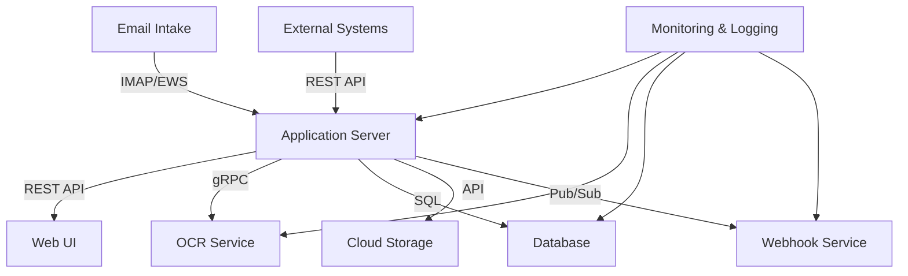

## COMPONENT DIAGRAMS

### Application Server Components

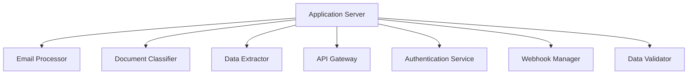

### Web UI Components

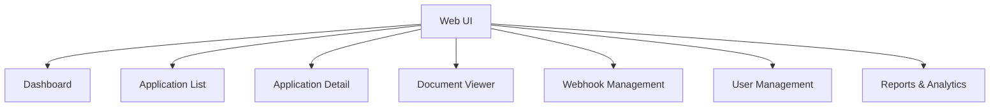

## SEQUENCE DIAGRAMS

### Application Processing Sequence

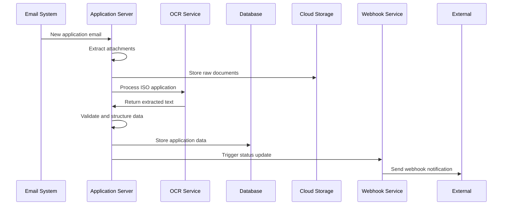

### User Authentication Sequence

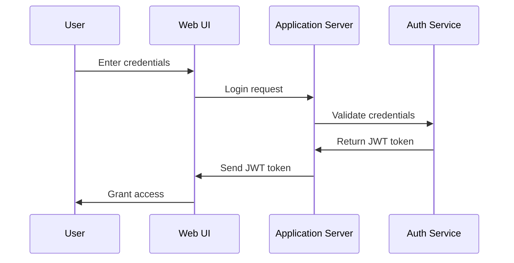

## DATA-FLOW DIAGRAM

The following diagram illustrates how information moves through the MCA application processing system:

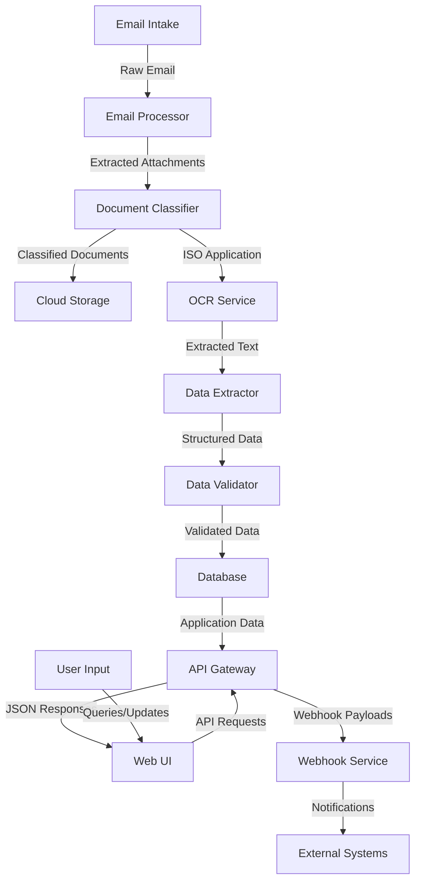

This data flow diagram shows the movement of information from the initial email intake through various processing stages, storage, and finally to the user interface and external systems. The system is designed to efficiently handle the flow of data, ensuring that each component receives the necessary information to perform its function in the MCA application processing workflow.

# SYSTEM DESIGN

## PROGRAMMING LANGUAGES

The MCA application processing system will utilize the following programming languages:

1. Python (Backend)
   - Justification: Python is chosen for its simplicity, readability, and extensive library support. It's well-suited for data processing, API development, and integration with Google Cloud services.
   - Use cases: API development, data processing, OCR integration, webhook management

2. TypeScript (Frontend)
   - Justification: TypeScript adds static typing to JavaScript, enhancing code quality and developer productivity. It integrates well with React and provides better tooling support.
   - Use cases: React component development, state management, API integration

3. SQL (Database)
   - Justification: SQL is the standard language for relational databases. It will be used with Google Cloud SQL (PostgreSQL) for structured data storage and retrieval.
   - Use cases: Database queries, data manipulation, and schema management

4. HTML/CSS (Frontend)
   - Justification: HTML and CSS are fundamental for web development. Tailwind CSS will be used as a utility-first CSS framework for rapid UI development.
   - Use cases: Structuring web pages, styling components, and creating responsive layouts

5. Shell Scripting (DevOps)
   - Justification: Shell scripts are essential for automation in deployment, testing, and maintenance processes.
   - Use cases: CI/CD pipelines, server configuration, automated backups

## DATABASE DESIGN

The MCA application processing system will use Google Cloud SQL with PostgreSQL as the relational database management system. The database schema is designed to efficiently store and manage application data, user information, and system metadata.

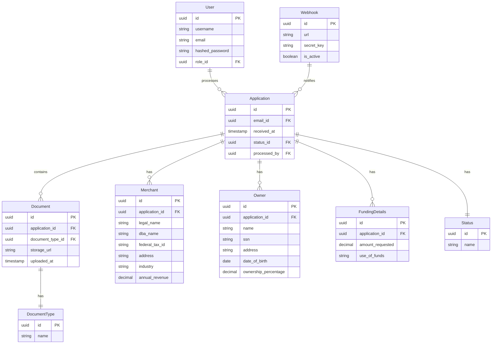

Key considerations:
- Use of UUIDs as primary keys for better scalability and data distribution
- Separation of concerns with normalized tables (e.g., Status, DocumentType)
- Indexing on frequently queried columns (e.g., application_id, email_id)
- Use of appropriate data types (e.g., timestamp for dates, decimal for financial amounts)

## API DESIGN

The MCA application processing system will expose a RESTful API for internal and external consumption. The API will be developed using Python with the Flask framework and will adhere to RESTful principles and best practices.

### API Endpoints

1. Applications
```
GET    /api/v1/applications
POST   /api/v1/applications
GET    /api/v1/applications/{id}
PUT    /api/v1/applications/{id}
DELETE /api/v1/applications/{id}
```

2. Documents
```
GET    /api/v1/applications/{id}/documents
POST   /api/v1/applications/{id}/documents
GET    /api/v1/applications/{id}/documents/{doc_id}
DELETE /api/v1/applications/{id}/documents/{doc_id}
```

3. Webhooks
```
GET    /api/v1/webhooks
POST   /api/v1/webhooks
GET    /api/v1/webhooks/{id}
PUT    /api/v1/webhooks/{id}
DELETE /api/v1/webhooks/{id}
```

4. Users
```
GET    /api/v1/users
POST   /api/v1/users
GET    /api/v1/users/{id}
PUT    /api/v1/users/{id}
DELETE /api/v1/users/{id}
```

### API Security

- Authentication: OAuth 2.0 with JWT tokens
- Authorization: Role-based access control (RBAC)
- Rate limiting: Implement rate limiting to prevent abuse
- Input validation: Validate all input data to prevent injection attacks
- HTTPS: All API communications will be encrypted using TLS 1.2 or higher

### API Documentation

The API will be documented using OpenAPI (Swagger) specification, providing detailed information about endpoints, request/response formats, and authentication requirements.

## USER INTERFACE DESIGN

The MCA application processing system will feature a web-based user interface developed using React, TypeScript, and Tailwind CSS. The UI will be responsive, accessible, and optimized for desktop and tablet devices.

### Key UI Components

1. Dashboard
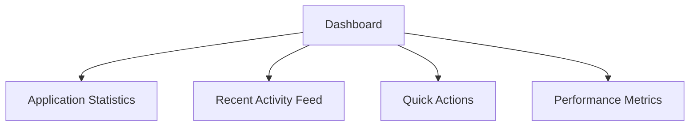

2. Application List
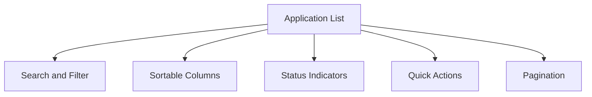

3. Application Detail View
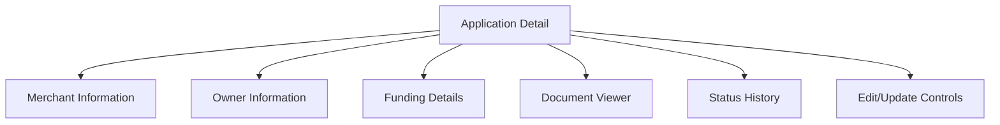

4. Webhook Management
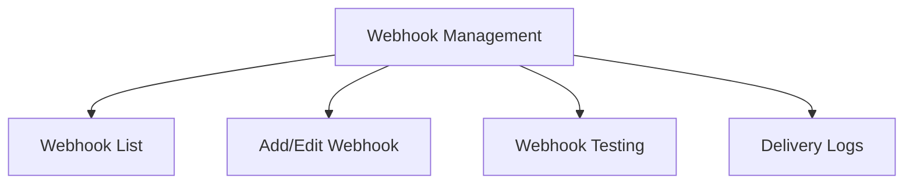

5. User Management
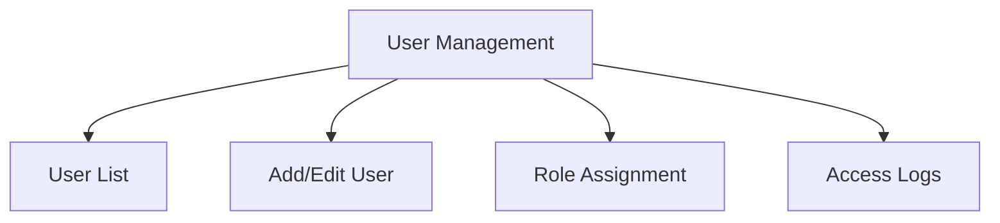

### UI/UX Considerations

1. Responsive Design: The UI will adapt to different screen sizes, with a focus on desktop and tablet devices.
2. Accessibility: Implement WCAG 2.1 Level AA compliance for accessibility.
3. Performance: Optimize component rendering and implement lazy loading for improved performance.
4. Consistency: Use a consistent color scheme, typography, and component design throughout the application.
5. Error Handling: Implement user-friendly error messages and validation feedback.
6. Progressive Enhancement: Ensure core functionality works without JavaScript, enhancing features for modern browsers.

### Sample UI Component (React/TypeScript)

```typescript
import React from 'react';

interface ApplicationListProps {
  applications: Application[];
  onSelectApplication: (id: string) => void;
}

const ApplicationList: React.FC<ApplicationListProps> = ({ applications, onSelectApplication }) => {
  return (
    <div className="container mx-auto p-4">
      <h2 className="text-2xl font-bold mb-4">Applications</h2>
      <table className="w-full border-collapse">
        <thead>
          <tr className="bg-gray-200">
            <th className="p-2 text-left">ID</th>
            <th className="p-2 text-left">Merchant Name</th>
            <th className="p-2 text-left">Status</th>
            <th className="p-2 text-left">Actions</th>
          </tr>
        </thead>
        <tbody>
          {applications.map((app) => (
            <tr key={app.id} className="border-b">
              <td className="p-2">{app.id}</td>
              <td className="p-2">{app.merchantName}</td>
              <td className="p-2">{app.status}</td>
              <td className="p-2">
                <button
                  onClick={() => onSelectApplication(app.id)}
                  className="bg-blue-500 text-white px-3 py-1 rounded hover:bg-blue-600"
                >
                  View
                </button>
              </td>
            </tr>
          ))}
        </tbody>
      </table>
    </div>
  );
};

export default ApplicationList;
```

This system design section provides a comprehensive overview of the programming languages, database structure, API design, and user interface components for the MCA application processing system. The design leverages modern technologies and best practices to ensure a scalable, maintainable, and user-friendly solution.

# TECHNOLOGY STACK

## PROGRAMMING LANGUAGES

| Language   | Justification                                                                                                                                                   | Use Cases                                                      |
|------------|------------------------------------------------------------------------------------------------------------------------------------------------------------------|----------------------------------------------------------------|
| Python     | - Versatile and widely used for backend development<br>- Extensive library support<br>- Strong integration with Google Cloud services<br>- Excellent for data processing | - Backend API development<br>- Data processing<br>- OCR integration<br>- Webhook management |
| TypeScript | - Adds static typing to JavaScript<br>- Improves code quality and maintainability<br>- Excellent tooling and IDE support<br>- Seamless integration with React            | - Frontend development<br>- State management<br>- API integration |
| SQL        | - Standard language for relational databases<br>- Powerful querying capabilities<br>- Widely supported and understood                                                    | - Database queries<br>- Data manipulation<br>- Reporting |

## FRAMEWORKS AND LIBRARIES

### Backend

| Framework/Library | Purpose                                                     |
|-------------------|-------------------------------------------------------------|
| Flask             | Lightweight web framework for building the RESTful API      |
| SQLAlchemy        | ORM for database interactions                               |
| Celery            | Distributed task queue for background job processing        |
| Pydantic          | Data validation and settings management                     |
| pytest            | Testing framework for Python code                           |

### Frontend

| Framework/Library | Purpose                                                     |
|-------------------|-------------------------------------------------------------|
| React             | UI component library for building the web interface         |
| React Router      | Routing library for single-page application navigation      |
| Redux             | State management for complex application states             |
| Axios             | HTTP client for API requests                                |
| React Query       | Data fetching and caching library                           |
| Tailwind CSS      | Utility-first CSS framework for styling                     |
| Jest              | Testing framework for JavaScript code                       |

## DATABASES

| Database          | Purpose                                                     |
|-------------------|-------------------------------------------------------------|
| Google Cloud SQL (PostgreSQL) | Primary relational database for structured application data |
| Google Cloud Storage          | Object storage for document files (PDFs)                     |
| Redis                         | Caching and session management                               |

## THIRD-PARTY SERVICES

| Service                    | Purpose                                                     |
|----------------------------|-------------------------------------------------------------|
| Google Cloud Vision API    | OCR processing for document text extraction                 |
| Google Cloud Identity Platform | User authentication and authorization                   |
| Google Cloud Pub/Sub       | Messaging service for event-driven architecture             |
| Google Cloud Monitoring    | System monitoring and alerting                              |
| Google Cloud Logging       | Centralized logging for application and system logs         |
| SendGrid                   | Email delivery service for notifications                    |
| Stripe                     | Payment processing for potential future billing integration |

## ARCHITECTURE OVERVIEW

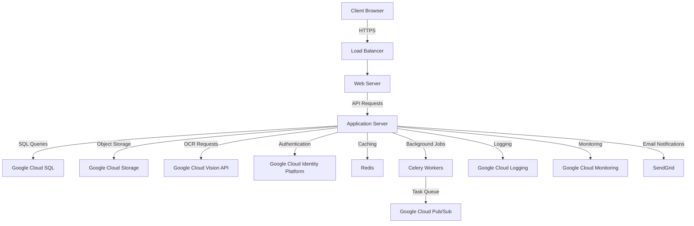

This technology stack leverages the Google Cloud ecosystem for most of the infrastructure and services, while using industry-standard frameworks and libraries for both frontend and backend development. The combination of TypeScript, React, and Tailwind CSS for the frontend, along with Python and Flask for the backend, provides a robust and scalable foundation for the MCA application processing system. The use of Google Cloud services ensures high availability, scalability, and integration with advanced features like OCR and identity management.

# SECURITY CONSIDERATIONS

## AUTHENTICATION AND AUTHORIZATION

The MCA application processing system will implement a robust authentication and authorization mechanism to ensure secure access to the system and its resources.

### Authentication

1. User Authentication:
   - Implement OAuth 2.0 with OpenID Connect using Google Cloud Identity Platform
   - Support multi-factor authentication (MFA) for all user accounts
   - Enforce strong password policies (minimum length, complexity, expiration)

2. API Authentication:
   - Use API keys for external system integrations
   - Implement JWT (JSON Web Tokens) for stateless authentication

3. Service-to-Service Authentication:
   - Utilize Google Cloud Service Accounts for internal service communication

### Authorization

1. Role-Based Access Control (RBAC):
   - Implement fine-grained RBAC using Google Cloud Identity and Access Management (IAM)
   - Define the following roles:
     - Administrator
     - Manager
     - Processor
     - Auditor
     - API Client

2. Access Control Matrix:

| Role         | View Applications | Edit Applications | Manage Users | Access API | View Reports |
|--------------|-------------------|-------------------|--------------|------------|--------------|
| Administrator| ✓                 | ✓                 | ✓            | ✓          | ✓            |
| Manager      | ✓                 | ✓                 |              | ✓          | ✓            |
| Processor    | ✓                 | ✓                 |              |            |              |
| Auditor      | ✓                 |                   |              |            | ✓            |
| API Client   |                   |                   |              | ✓          |              |

3. Least Privilege Principle:
   - Assign minimum necessary permissions to each role
   - Regularly review and audit access permissions

4. API Authorization:
   - Implement OAuth 2.0 scopes for API access control
   - Use API keys with IP whitelisting for external integrations

### Authentication Flow

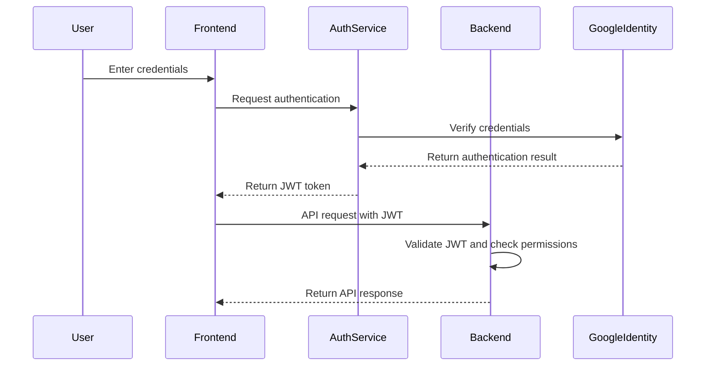

## DATA SECURITY

The MCA application processing system will implement comprehensive data security measures to protect sensitive information throughout its lifecycle.

1. Data Encryption:
   - Encrypt data in transit using TLS 1.3
   - Implement encryption at rest for all data stored in Google Cloud SQL and Google Cloud Storage
   - Use Google Cloud Key Management Service (KMS) for encryption key management

2. Data Classification:
   - Implement a data classification system:
     - Public
     - Internal
     - Confidential
     - Restricted
   - Apply appropriate security controls based on data classification

3. Personally Identifiable Information (PII) Protection:
   - Implement data masking for sensitive fields (e.g., SSN, Tax ID) in the UI
   - Use data tokenization for storing sensitive information in the database
   - Implement strict access controls for PII data

4. Data Loss Prevention (DLP):
   - Utilize Google Cloud DLP API to detect and redact sensitive information in documents and data streams
   - Implement DLP policies to prevent unauthorized data exfiltration

5. Secure Data Deletion:
   - Implement secure data deletion procedures for expired or requested data removal
   - Use Google Cloud Storage Object Lifecycle Management for automated deletion of old documents

6. Database Security:
   - Enable Google Cloud SQL audit logging
   - Implement database connection encryption
   - Use prepared statements to prevent SQL injection attacks

7. Secure File Handling:
   - Implement virus scanning for uploaded documents using Google Cloud Security Command Center
   - Enforce strict file type restrictions for uploads
   - Generate and use signed URLs for secure document access

## SECURITY PROTOCOLS

The MCA application processing system will adhere to industry-standard security protocols and best practices to maintain a robust security posture.

1. Network Security:
   - Implement Google Cloud VPC (Virtual Private Cloud) for network isolation
   - Use Google Cloud Armor for DDoS protection and Web Application Firewall (WAF)
   - Enable Google Cloud Identity-Aware Proxy (IAP) for secure access to admin interfaces

2. Security Monitoring and Incident Response:
   - Utilize Google Cloud Security Command Center for threat detection and security analytics
   - Implement a Security Information and Event Management (SIEM) system
   - Establish an incident response plan with defined roles and procedures

3. Vulnerability Management:
   - Conduct regular vulnerability scans using Google Cloud Security Scanner
   - Implement a bug bounty program for responsible disclosure of vulnerabilities
   - Maintain a patch management process for timely security updates

4. Secure Development Lifecycle:
   - Implement secure coding practices and guidelines
   - Conduct regular security code reviews
   - Perform static and dynamic application security testing (SAST/DAST)

5. Third-Party Security:
   - Conduct security assessments for all third-party integrations
   - Implement vendor risk management procedures
   - Ensure compliance with security requirements for all external services

6. Compliance and Auditing:
   - Maintain compliance with relevant standards (e.g., PCI DSS, SOC 2)
   - Conduct regular security audits and penetration testing
   - Implement comprehensive logging and auditing using Google Cloud Audit Logs

7. Security Training and Awareness:
   - Provide regular security awareness training for all employees
   - Conduct simulated phishing exercises
   - Maintain up-to-date security policies and procedures

8. API Security:
   - Implement rate limiting and throttling to prevent API abuse
   - Use OAuth 2.0 for API authentication and authorization
   - Validate and sanitize all API inputs to prevent injection attacks

9. Secure Configuration Management:
   - Use Google Cloud Deployment Manager for infrastructure-as-code
   - Implement secure baseline configurations for all system components
   - Regularly review and update security configurations

10. Backup and Disaster Recovery:
    - Implement regular automated backups of all critical data
    - Establish a disaster recovery plan with defined Recovery Time Objectives (RTO) and Recovery Point Objectives (RPO)
    - Conduct regular disaster recovery drills

Security Protocols Overview:

```mermaid
graph TD
    A[Security Protocols] --> B[Network Security]
    A --> C[Monitoring & Incident Response]
    A --> D[Vulnerability Management]
    A --> E[Secure Development]
    A --> F[Third-Party Security]
    A --> G[Compliance & Auditing]
    A --> H[Security Training]
    A --> I[API Security]
    A --> J[Configuration Management]
    A --> K[Backup & Disaster Recovery]

    B --> B1[VPC]
    B --> B2[Cloud Armor]
    B --> B3[IAP]

    C --> C1[Security Command Center]
    C --> C2[SIEM]
    C --> C3[Incident Response Plan]

    D --> D1[Vulnerability Scans]
    D --> D2[Bug Bounty]
    D --> D3[Patch Management]

    E --> E1[Secure Coding]
    E --> E2[Code Reviews]
    E --> E3[SAST/DAST]

    I --> I1[Rate Limiting]
    I --> I2[OAuth 2.0]
    I --> I3[Input Validation]
```

By implementing these comprehensive security considerations, the MCA application processing system will maintain a strong security posture, protecting sensitive data and ensuring the integrity and confidentiality of all processed information.